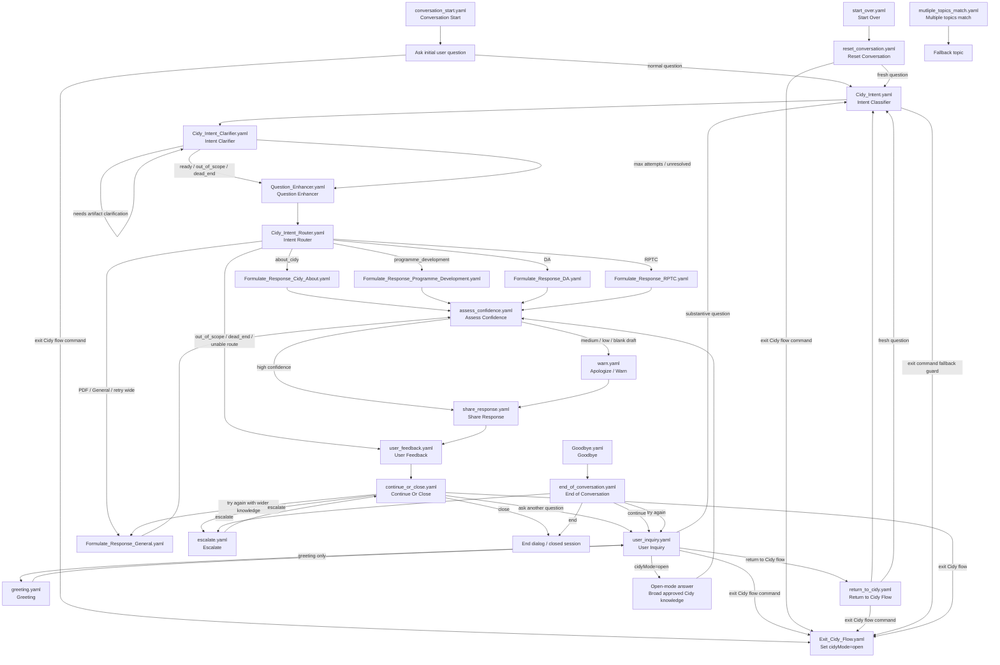
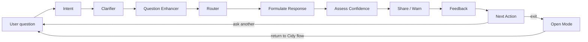

# Cidy Topic Flow Mermaid

```mermaid
flowchart TD
  %% Entry points
  CS["conversation_start.yaml<br/>Conversation Start"] --> UQ0["Ask initial user question"]
  UQ0 -->|normal question| INTENT["Cidy_Intent.yaml<br/>Intent Classifier"]
  UQ0 -->|exit Cidy flow command| EXIT["Exit_Cidy_Flow.yaml<br/>Set cidyMode=open"]

  GREET["greeting.yaml<br/>Greeting"] --> UINQ["user_inquiry.yaml<br/>User Inquiry"]
  STARTOVER["start_over.yaml<br/>Start Over"] --> RESET["reset_conversation.yaml<br/>Reset Conversation"]
  GOODBYE["Goodbye.yaml<br/>Goodbye"] --> EOC["end_of_conversation.yaml<br/>End of Conversation"]
  RETURN["return_to_cidy.yaml<br/>Return to Cidy Flow"] --> INTENT

  %% User inquiry
  UINQ -->|cidyMode=open| OPEN["Open-mode answer<br/>Broad approved Cidy knowledge"]
  OPEN --> ASSESS["assess_confidence.yaml<br/>Assess Confidence"]
  UINQ -->|return to Cidy flow| RETURN
  UINQ -->|greeting only| GREET
  UINQ -->|substantive question| INTENT
  UINQ -->|exit Cidy flow command| EXIT

  %% Reset / return prompts
  RESET -->|fresh question| INTENT
  RESET -->|exit Cidy flow command| EXIT
  RETURN -->|fresh question| INTENT
  RETURN -->|exit Cidy flow command| EXIT

  %% Intent pipeline
  INTENT -->|exit command fallback guard| EXIT
  INTENT --> CLAR["Cidy_Intent_Clarifier.yaml<br/>Intent Clarifier"]

  CLAR -->|ready / out_of_scope / dead_end| ENH["Question_Enhancer.yaml<br/>Question Enhancer"]
  CLAR -->|needs fund clarification| CLAR
  CLAR -->|needs domain clarification| CLAR
  CLAR -->|needs artifact clarification| CLAR
  CLAR -->|max attempts / unresolved| ENH

  ENH --> ROUTER["Cidy_Intent_Router.yaml<br/>Intent Router"]

  %% Router outcomes
  ROUTER -->|about_cidy| ABOUT["Formulate_Response_Cidy_About.yaml"]
  ROUTER -->|programme_development| PD["Formulate_Response_Programme_Development.yaml"]
  ROUTER -->|DA| DA["Formulate_Response_DA.yaml"]
  ROUTER -->|RPTC| RPTC["Formulate_Response_RPTC.yaml"]
  ROUTER -->|PDF / General / retry wide| GEN["Formulate_Response_General.yaml"]
  ROUTER -->|out_of_scope / dead_end / unable route| FEEDBACK["user_feedback.yaml<br/>User Feedback"]

  %% Response topics
  ABOUT --> ASSESS
  PD --> ASSESS
  DA --> ASSESS
  RPTC --> ASSESS
  GEN --> ASSESS

  %% Confidence / answer sharing
  ASSESS -->|high confidence| SHARE["share_response.yaml<br/>Share Response"]
  ASSESS -->|medium / low / blank draft| WARN["warn.yaml<br/>Apologize / Warn"]
  WARN --> SHARE
  SHARE --> FEEDBACK

  %% Feedback and next actions
  FEEDBACK --> NEXT["continue_or_close.yaml<br/>Continue Or Close"]

  NEXT -->|ask another question| UINQ
  NEXT -->|try again with wider knowledge| GEN
  NEXT -->|escalate| ESC["escalate.yaml<br/>Escalate"]
  NEXT -->|exit Cidy flow| EXIT
  NEXT -->|close| CLOSED["End dialog / closed session"]

  ESC --> NEXT

  %% End of conversation topic
  EOC -->|continue| UINQ
  EOC -->|try again| UINQ
  EOC -->|escalate| ESC
  EOC -->|end| CLOSED

  %% Misc/system
  MULTI["mutliple_topics_match.yaml<br/>Multiple topics match"] --> FALLBACK["Fallback topic"]
```

## Main Loop

```mermaid
flowchart LR
  U["User question"] --> I["Intent"]
  I --> C["Clarifier"]
  C --> Q["Question Enhancer"]
  Q --> R["Router"]
  R --> F["Formulate Response"]
  F --> A["Assess Confidence"]
  A --> S["Share / Warn"]
  S --> FB["Feedback"]
  FB --> N["Next Action"]
  N -->|ask another| U
  N -->|exit| O["Open Mode"]
  O -->|return to Cidy flow| U
```
